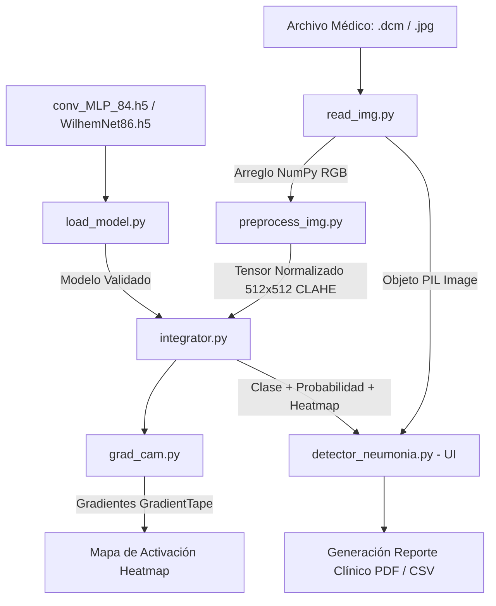

# 🫁 Sistema Inteligente para Detección Rápida de Neumonía (UAO-Neumonia)

[](https://www.python.org/)
[](https://astral.sh/uv)
[](https://www.tensorflow.org/)
[](https://docs.pytest.org/)
[](https://www.docker.com/)
[](https://opensource.org/licenses/MIT)

Sistema clínico asistido por Inteligencia Artificial para la clasificación automática de radiografías de tórax en formato médico **DICOM** e imágenes **JPG/PNG** en tres clases diagnósticas:
1. **Neumonía Bacteriana**
2. **Neumonía Viral**
3. **Normal (Sin Neumonía)**

Incluye **Explicabilidad Médica (XAI)** mediante **Grad-CAM** (*Gradient-weighted Class Activation Mapping*), generando mapas de calor que resaltan las regiones pulmonares anatómicamente relevantes para la decisión de la red neuronal.

---

## 🚀 Hitos Clave de la Refactorización y Modernización

El código base original (monolítico, legado para Windows y TensorFlow 1.x) fue completamente reescrito bajo estándares modernos de ingeniería de software e inteligencia artificial:

1. **Migración a Python 3.13 y Keras 3 (TensorFlow 2.16+):**
   * Eliminación de las llamadas estáticas en desuso `tf.compat.v1.disable_eager_execution()` y `K.gradients`.
   * Implementación de **`tf.GradientTape()`** dinámico para el cálculo seguro y moderno de los gradientes de activación de Grad-CAM.
2. **Compatibilidad Multiplataforma y Servidores Gráficos Modernos (Wayland):**
   * Sustitución de librerías obsoletas dependientes de Windows (`tkcap`).
   * Generación programática de reportes clínicos en PDF directamente en memoria con **Pillow (`PIL`)**, resolviendo bloqueos de seguridad de X11/Wayland en Linux y facilitando la ejecución en Docker (*headless*).
3. **Arquitectura Modular (Alta Cohesión y Bajo Acoplamiento):**
   * Desacoplamiento total entre la lógica del modelo matemático y la interfaz gráfica según principios de *Clean Code* (ArjanCodes).
4. **Automatización Integral del Ciclo de Vida (Makefile + UV):**
   * Gestión estricta de dependencias sin PIP (`uv.lock`).
   * Comandos automatizados para ejecución, suite de pruebas unitarias (`pytest`), reportes fechados automáticos y control de versiones Git.
5. **Limpieza Estricta y Supresión de Warnings (0 Warnings):**
   * Eliminación del `UserWarning` de Keras 3 corrigiendo la estructura de entrada de tensores en `grad_cam.py` (`[batch_tensor]`).
   * Supresión de los mensajes informativos de C++ y CUDA (`stderr` redirection a nivel de descriptor de archivo de sistema operativo), logrando una ejecución limpia y profesional en consola.


---

## 📐 Diagrama de Flujo de Datos y Arquitectura Modular



---

## 📂 Estructura del Repositorio

```text
UAO-Neumonia/
├── Makefile                 # Automatización de tareas (run, test, commit, clean)
├── Dockerfile               # Configuración para contenedor Docker
├── pyproject.toml           # Metadatos del proyecto y dependencias UV
├── uv.lock                  # Bloqueo determinista de versiones de librerías
├── README.md                # Documentación principal del proyecto
├── .gitignore               # Exclusión de pesos pesados (.h5) y entornos
├── data/                    # Imágenes de prueba clínicas (DICOM y JPG)
├── reports/                 # Logs históricos de pruebas unitarias con timestamp
├── src/                     # Código fuente modularizado
│   ├── __init__.py          # Declaración de paquete de Python
│   ├── detector_neumonia.py # Interfaz Gráfica (GUI Tkinter) y punto de entrada
│   ├── read_img.py          # MÓDULO 1: Lectura y validación DICOM/JPG
│   ├── preprocess_img.py    # MÓDULO 2: Pipeline de preprocesamiento (CLAHE, 512x512)
│   ├── load_model.py        # MÓDULO 3: Carga e inspección del modelo convolucional
│   ├── grad_cam.py          # MÓDULO 4: Explicabilidad Grad-CAM con GradientTape
│   └── integrator.py        # MÓDULO 5: Orquestador y fachada de servicios
└── test/                    # Suite de pruebas unitarias automatizadas (pytest)
    ├── test_read_img.py     # Tests para lectura de imágenes y excepciones
    ├── test_preprocess.py   # Tests para transformaciones numéricas
    ├── test_load_model.py   # Tests de integridad de red neuronal
    └── test_grad_cam.py     # Tests de dimensionalidad del mapa de calor
```

---

## 🛠️ Instalación y Requisitos

### Requisitos Previos:
* Sistema Operativo: Linux (Ubuntu 22.04+), macOS o Windows (WSL2).
* Gestor de Entornos: **UV** (Python 3.13).
* Herramienta de compilación: **Make** (`sudo apt install -y make`).

### 1. Clonar el repositorio y sincronizar entorno:
```bash
git clone <URL_DEL_REPOSITORIO>
cd UAO-Neumonia
uv sync
```

---

## ⚡ Automatización con `Makefile`

El proyecto implementa un flujo estandarizado de comandos:

| Comando | Acción |
| :--- | :--- |
| `make run` | Inicia la interfaz gráfica de detección. |
| `make test` | Ejecuta toda la batería de pruebas y guarda el log en `reports/`. |
| `make test-read` | Ejecuta exclusivamente las pruebas del Módulo 1 (`read_img.py`). |
| `make test-preprocess`| Ejecuta pruebas del Módulo 2 (`preprocess_img.py`). |
| `make test-model` | Ejecuta pruebas del Módulo 3 (`load_model.py`). |
| `make test-gradcam` | Ejecuta pruebas del Módulo 4 (`grad_cam.py`). |
| `make commit` | Flujo interactivo guiado para registrar cambios en Git. |
| `make clean` | Remueve archivos temporales y cachés (`.pytest_cache`, `__pycache__`). |

---

## 🐳 Despliegue y Reproducibilidad con Docker

El proyecto cuenta con un `Dockerfile` optimizado multi-etapa basado en **`python:3.13-slim`** y la imagen oficial de **UV (`ghcr.io/astral-sh/uv`)**.

### ¿Cómo garantiza la reproducibilidad en cualquier computadora?
1. **Sin PIP ni desvío de versiones:** No se utiliza `pip install`. El contenedor aprovecha el archivo `uv.lock` generado en desarrollo.
2. **Sincronización congelada (`uv sync --frozen`):** Se instalan exactamente los mismos paquetes binarios y dependencias probadas, sin importar si el host es Windows, Mac o Linux.
3. **Aislamiento total:** Incluye las librerías nativas del sistema requeridas por OpenCV (`libgl1`, `libglib2.0-0`) y soporte para pruebas automáticas.

### Comandos de ejecución con Docker:

```bash
# 1. Construir la imagen localmente (utilizando la caché de capas de UV)
docker build -t uao-neumonia:latest .

# 2. Ejecutar la suite de pruebas unitarias dentro del contenedor aislado
docker run --rm uao-neumonia:latest

# 3. Ejecutar un comando específico o shell interactivo dentro del contenedor
docker run -it --rm uao-neumonia:latest bash
```

---

## 📄 Licencia

Este proyecto se encuentra bajo la Licencia **MIT**. Consulte el archivo `LICENSE` para más detalles.
