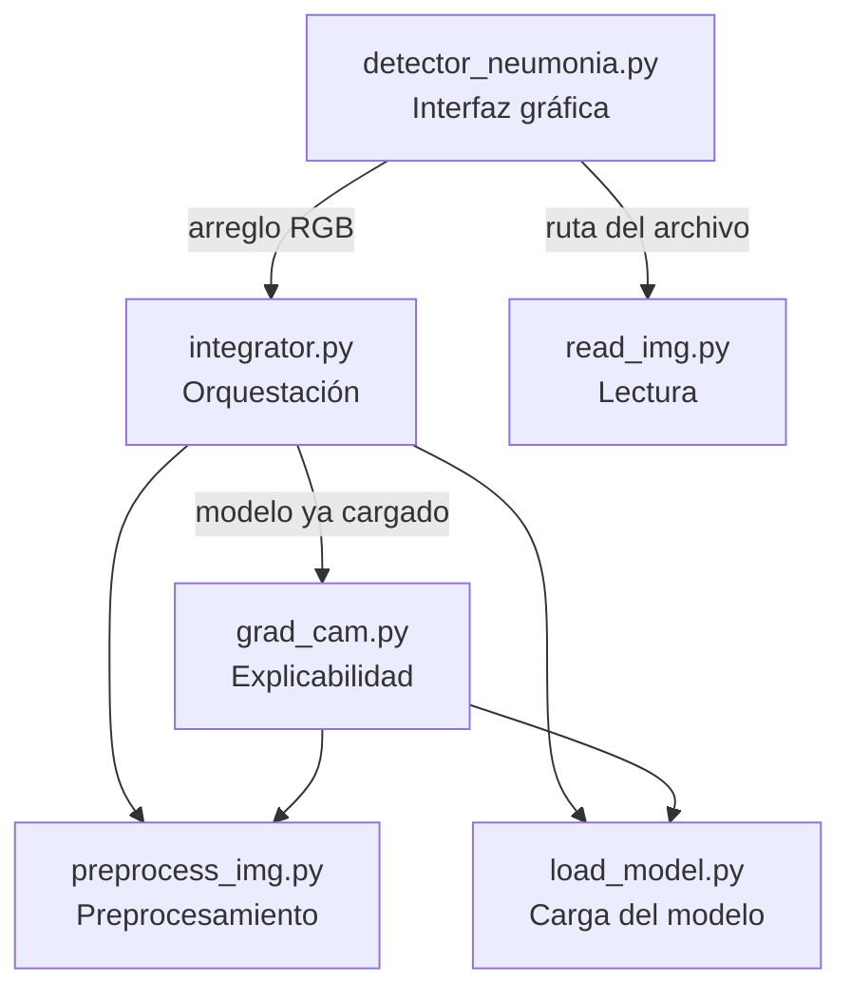
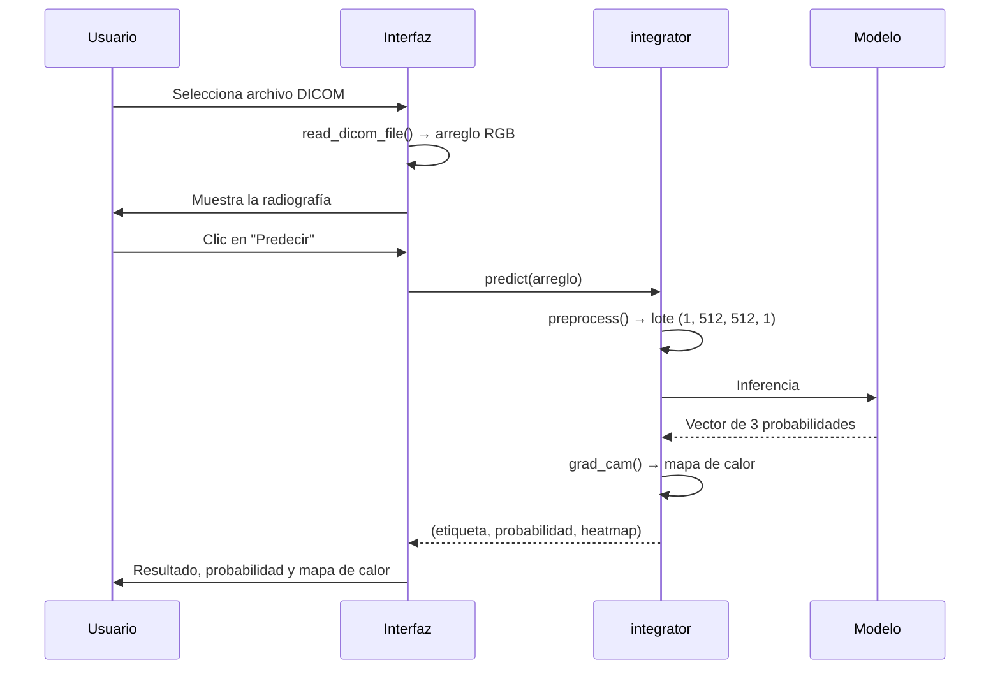

# Detección de Neumonía en Radiografías de Tórax


Herramienta de apoyo al diagnóstico médico que clasifica radiografías de tórax en
**neumonía bacteriana**, **neumonía viral** o **sin neumonía**, y explica su decisión
mediante un mapa de calor Grad-CAM superpuesto sobre la imagen original.

> **Aviso**: este software es un ejercicio académico. No constituye un dispositivo
> médico ni debe usarse para tomar decisiones clínicas.

---

## Tabla de contenido

- [Características](#características)
- [Árbol del proyecto](#árbol-del-proyecto)
- [Arquitectura](#arquitectura)
- [Flujo de datos](#flujo-de-datos)
- [Requisitos](#requisitos)
- [Instalación](#instalación)
- [Ejecución](#ejecución)
- [Ejecución con Docker](#ejecución-con-docker)
- [Uso de la aplicación](#uso-de-la-aplicación)
- [Pruebas](#pruebas)
- [Módulos](#módulos)
- [Decisiones de diseño](#decisiones-de-diseño)
- [Errores corregidos del código base](#errores-corregidos-del-código-base)
- [Limitaciones conocidas](#limitaciones-conocidas)
- [Licencia](#licencia)
- [Autores]- Marlon Valencia Velosa — [@marlonvalenciamentor-eng](https://github.com/marlonvalenciamentor-eng)

---

## Características

- Lectura de imágenes en formato **DICOM** y **JPG/PNG**.
- Preprocesamiento estándar: redimensionamiento a 512×512, escala de grises,
  ecualización adaptativa **CLAHE** y normalización.
- Inferencia con una red convolucional entrenada (`conv_MLP_84.h5`, arquitectura
  `Net5Blocks`, 57 capas).
- Explicabilidad con **Grad-CAM** implementado sobre `tf.GradientTape`.
- Interfaz gráfica en Tkinter con exportación de resultados a **CSV** y **PDF**.
- Suite de pruebas unitarias con **pytest** que se ejecuta sin necesidad del modelo.

---

## Árbol del proyecto

```text
UAO-Neumonia/
├── src/                       Lógica del pipeline
│   ├── __init__.py
│   ├── read_img.py            Lectura de DICOM y JPG a arreglos NumPy
│   ├── preprocess_img.py      Redimensionado, CLAHE y normalización
│   ├── load_model.py          Carga del modelo con caché
│   ├── grad_cam.py            Mapa de calor con GradientTape
│   └── integrator.py          Orquestación del pipeline completo
├── tests/                     Pruebas unitarias
│   ├── __init__.py
│   ├── conftest.py            Fixtures: imágenes y DICOM sintéticos
│   ├── test_read_img.py
│   ├── test_preprocess_img.py
│   ├── test_load_model.py
│   └── test_integrator.py
├── detector_neumonia.py       Interfaz gráfica (Tkinter)
├── compat_tix.py              Compatibilidad de tkcap con Python 3.13
├── conftest.py                Habilita la raíz en el path de pytest
├── Dockerfile
├── Makefile                   Automatización de tareas
├── pyproject.toml             Configuración del proyecto y de pytest
├── requirements.txt           Dependencias con versiones fijadas
├── uv.lock                    Resolución exacta del entorno
├── LICENSE.md
└── README.md
```

Los archivos de pesos (`conv_MLP_84.h5`, `WilhemNet86.h5`) y las salidas de la
aplicación (`historial.csv`, `Reporte*.pdf`) están excluidos del repositorio.

---

## Arquitectura

Cada módulo tiene una responsabilidad única y no conoce los detalles internos de
los demás. La interfaz gráfica solo depende de `integrator` y de `read_img`.



El modelo se carga **una sola vez** por ejecución. `integrator` lo obtiene de
`load_model` y lo inyecta en `grad_cam`, en lugar de que cada módulo lo lea del
disco por su cuenta.

---

## Flujo de datos



---

## Requisitos

| Componente | Versión |
|---|---|
| Python | 3.13 |
| uv | 0.12 o superior |
| Modelo entrenado | `conv_MLP_84.h5` en la raíz del proyecto |
| Docker | 20.10 o superior (opcional) |
| GNU Make | 4.4 o superior (opcional) |

En Windows, `make` no viene incluido. Se instala con
[Chocolatey](https://chocolatey.org/install): `choco install make`.

---

## Instalación

```bash
git clone https://github.com/marlonvalenciamentor-eng/UAO-Neumonia.git
cd UAO-Neumonia

uv venv --python 3.13
uv pip install -r requirements.txt
```

O con Make:

```bash
make install
```

Coloque el archivo `conv_MLP_84.h5` en la raíz del proyecto. No está incluido en
el repositorio por su tamaño (112 MB).

---

## Ejecución

```bash
uv run detector_neumonia.py
```

O con Make:

```bash
make run
```

---

## Ejecución con Docker

```bash
# Construir la imagen
docker build -t neumonia .

# Ejecutar montando la carpeta de datos
docker run -v $(pwd)/data:/app/data neumonia
```

O con Make:

```bash
make docker-build
make docker-run
```

La interfaz gráfica requiere un servidor X11. En Linux se expone el display del
anfitrión; en Windows y macOS se recomienda usar el contenedor únicamente para
procesamiento por lotes.

---

## Uso de la aplicación

1. **Cargar Imagen** — abre el selector de archivos y muestra la radiografía.
2. **Predecir** — ejecuta el pipeline y muestra la clase, la probabilidad y el
   mapa de calor.
3. **Guardar** — agrega el resultado a `historial.csv`.
4. **PDF** — genera un reporte con captura de la ventana.
5. **Borrar** — limpia la interfaz para un nuevo caso.


---

## Pruebas

```bash
uv run pytest -v
```

O con Make:

```bash
make test
```

La suite cubre las cuatro áreas del pipeline:

| Archivo | Qué verifica |
|---|---|
| `test_read_img.py` | Forma y rango de los arreglos leídos desde DICOM y JPG, y el error ante archivos inexistentes |
| `test_preprocess_img.py` | Forma del lote, normalización a 0–1, independencia del tamaño de entrada y determinismo |
| `test_load_model.py` | Error ante rutas inválidas, efectividad de la caché y presencia de la capa usada por Grad-CAM |
| `test_integrator.py` | Cobertura de las tres clases y contrato de salida del pipeline completo |

Las pruebas que necesitan el modelo entrenado se **omiten automáticamente** si el
archivo `.h5` no está presente, de modo que la suite se ejecuta en cualquier
máquina y en entornos de integración continua.

---

## Módulos

| Módulo | Responsabilidad | Entrada | Salida |
|---|---|---|---|
| `read_img` | Lectura de archivos | Ruta a DICOM o JPG | Arreglo RGB e imagen PIL |
| `preprocess_img` | Acondicionamiento | Arreglo RGB | Lote `(1, 512, 512, 1)` normalizado |
| `load_model` | Acceso al modelo | Ruta al `.h5` | Modelo Keras en caché |
| `grad_cam` | Explicabilidad | Arreglo RGB y modelo | Imagen con mapa de calor |
| `integrator` | Orquestación | Arreglo RGB | Etiqueta, probabilidad y mapa |

---

## Decisiones de diseño

**Carga única del modelo.** El código base cargaba el archivo `.h5` dos veces por
predicción: una en `predict()` y otra dentro de `grad_cam()`. Con dos
predicciones consecutivas se observaron cuatro cargas del grafo. La caché de
`load_model` y la inyección del modelo en `grad_cam` reducen esto a una sola
lectura por ejecución.

**Grad-CAM con `GradientTape`.** La implementación original usaba `K.gradients` y
`K.function`, que exigen el modo grafo de TensorFlow 1 mediante
`disable_eager_execution()`. Esa dependencia generaba una docena de advertencias
de deprecación en cada ejecución. La reescritura con `tf.GradientTape` es el API
vigente, funciona en modo eager y eliminó esas advertencias.

**Constantes con nombre.** Valores como el tamaño de entrada, los parámetros de
CLAHE y el nombre de la capa convolucional dejaron de estar incrustados en el
cuerpo de las funciones. El nombre de la capa además es parámetro de `grad_cam`,
de modo que cambiar de modelo no obliga a editar el módulo.

**Validación de bordes.** La normalización original dividía por `array.max()` sin
verificar. Una imagen completamente negra producía una división por cero; ahora
se devuelve un arreglo de ceros.

**Separación de la interfaz.** `detector_neumonia.py` quedó reducido a la clase
`App`. No importa TensorFlow, OpenCV ni pydicom: solo conoce `integrator.predict`
y `read_img.read_dicom_file`.

---

## Errores corregidos del código base

El proyecto original fue escrito para Python 3.8, TensorFlow 2.8, Pillow 9 y
pydicom 2.3. Migrarlo a Python 3.13 requirió resolver los siguientes problemas:

| # | Síntoma | Causa | Solución |
|---|---|---|---|
| 1 | `ModuleNotFoundError: tkinter.tix` | El módulo fue eliminado en Python 3.13; `tkcap` aún lo importa | Módulo de compatibilidad `compat_tix.py` |
| 2 | `NameError: name 'tf' is not defined` | Faltaba `import tensorflow as tf` | Import agregado |
| 3 | `NameError: name 'model_fun' is not defined` | La función de carga del modelo no estaba definida | Implementada y luego trasladada a `load_model.py` |
| 4 | `AttributeError: read_file` | `pydicom.read_file` fue eliminado en pydicom 3.0 | Reemplazado por `dcmread` |
| 5 | `NameError: name 'dicom' is not defined` | Faltaba `import pydicom as dicom` | Import agregado |
| 6 | `NameError: name 'K' is not defined` | Faltaba el backend de Keras usado por Grad-CAM | Resuelto de raíz al reescribir con `GradientTape` |
| 7 | `AttributeError: Image.ANTIALIAS` | Eliminado en Pillow 10 | Reemplazado por `Image.Resampling.LANCZOS` |
| 8 | Inferencia lenta | El modelo se cargaba dos veces por predicción | Caché e inyección de dependencia |

Adicionalmente, los pesos `.h5` fueron guardados con Keras 2 y no son legibles por
Keras 3, que es la versión que acompaña a TensorFlow 2.21. Se resolvió instalando
`tf-keras` y activando `TF_USE_LEGACY_KERAS=1` antes de importar TensorFlow.

---

## Limitaciones conocidas

**La calidad del mapa de calor depende de la calidad de la imagen.** En
radiografías digitales limpias, las activaciones se concentran en los campos
pulmonares, como corresponde. En imágenes que son fotografías de placas
impresas —con marco, rotación y artefactos de borde— se observaron
activaciones en las esquinas y el contorno, pese a arrojar probabilidades
superiores al 85 %. Grad-CAM permite distinguir ambos casos: una predicción
con activaciones fuera del área pulmonar no debe considerarse confiable.

**Advertencias residuales de dependencias.** Persisten tres advertencias de
deprecación emitidas por `tf-keras` y `gast`, ambas dependencias internas de
TensorFlow. No provienen del código del proyecto y se resolverían migrando los
pesos al formato nativo `.keras` de Keras 3, lo que alteraría el modelo entregado
y queda fuera del alcance de este trabajo.

**`python-xlib` no tiene función en Windows.** Se conserva en `requirements.txt`
porque `pyautogui` la necesita en Linux, que es el sistema base del contenedor
Docker.

---

## Licencia

Distribuido bajo la licencia MIT. Consulte el archivo [LICENSE.md](LICENSE.md).

---

## Autores

<!-- Complete con los integrantes del grupo -->

- Marlon Valencia — [@marlonvalenciamentor-eng](https://github.com/marlonvalenciamentor-eng)

Proyecto guía del curso *Desarrollo de Proyectos de Inteligencia Artificial*,
especialización en Inteligencia Artificial, Universidad Autónoma de Occidente.

Repositorio base: [dalquinones/UAO-Neumonia](https://github.com/dalquinones/UAO-Neumonia)
