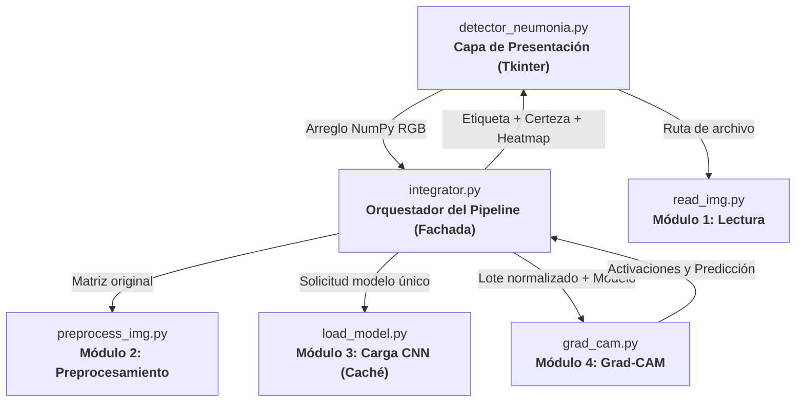
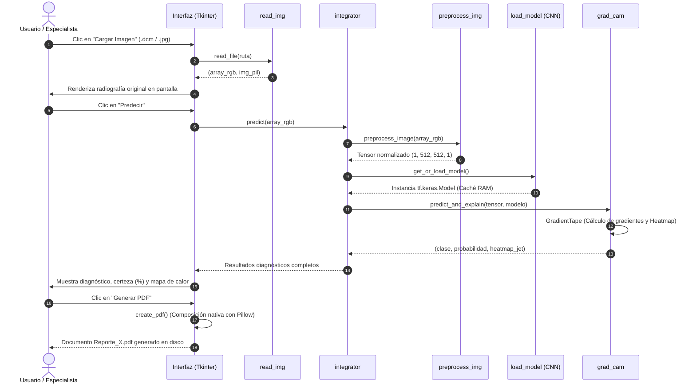

# Detección de Neumonía en Radiografías de Tórax


Herramienta de apoyo al diagnóstico médico que clasifica radiografías de tórax en **neumonía bacteriana**, **neumonía viral** o **sin neumonía (normal)**, y explica su decisión mediante un mapa de calor **Grad-CAM** superpuesto sobre la imagen anatómica original.

> **Aviso Médico y Académico**: Este software es un desarrollo con fines estrictamente académicos e investigativos dentro de la Especialización en Inteligencia Artificial de la Universidad Autónoma de Occidente. No constituye un dispositivo médico certificado ni debe emplearse como sustituto del criterio de un profesional de la salud.

---

## Tabla de contenido

- [Características](#características)
- [Árbol del proyecto](#árbol-del-proyecto)
- [Arquitectura](#arquitectura)
- [Flujo de datos](#flujo-de-datos)
- [Requisitos](#requisitos)
- [Instalación](#instalación)
- [Ejecución](#ejecución)
- [Ejecución con Docker](#ejecución-con-docker)
- [Uso de la aplicación](#uso-de-la-aplicación)
- [Pruebas (126 Tests)](#pruebas-126-tests)
- [Módulos](#módulos)
- [Decisiones de diseño](#decisiones-de-diseño)
- [Errores corregidos del código base](#errores-corregidos-del-código-base)
- [Limitaciones conocidas](#limitaciones-conocidas)
- [Licencia](#licencia)
- [Autores](#autores)

---

## Características

- **Lectura Multiformato**: Decodificación nativa de archivos clínicos estándar **DICOM (.dcm)** de 16 bits y formatos comprimidos comunes (**JPG, JPEG, PNG**).
- **Preprocesamiento Clínico y Morfológico**: Redimensionamiento espacial estándar (512×512), conversión monocromática de 1 canal, ecualización adaptativa de histograma de contraste limitado (**CLAHE**) y normalización numérica en rango flotante `[0.0, 1.0]`.
- **Inferencia Convolucional Optimizada**: Integración con la red entrenada (`conv_MLP_84.h5` / `WilhemNet86.h5`), validando la presencia de capas críticas (`conv10_thisone`).
- **Explicabilidad Médica con Grad-CAM**: Reescritura moderna sobre **`tf.GradientTape`** en modo *Eager Execution*, eliminando el modo estático de grafos y las advertencias de deprecación.
- **Interfaz Médica Responsiva y Accesible**: Diseño moderno basado en `ttk.Style` con layout `grid` fluido, empty states informativos, barra de progreso animada durante inferencia, prevención y diálogo amigable de errores clínicos, y atajos de teclado (`Ctrl+O`, `Enter`, `Ctrl+S`, `Esc`).
- **Reportes Clínicos Nativos en PDF**: Composición gráfica en memoria mediante Pillow (`PIL`) con tipografías vectoriales TrueType, eliminando dependencias obsoletas (`tkcap`) e incompatibilidades con servidores gráficos Wayland en Linux y contenedores Docker.
- **Persistencia en Historial CSV**: Registro histórico ordenado con identificador del paciente, marca temporal precisa, patología detectada y probabilidad porcentual.
- **Aseguramiento de Calidad Exhaustivo**: Suite de **126 pruebas unitarias** estructuradas con `pytest`, ejecutables de forma desatendida (*headless*) en menos de 28 segundos y con archivo automático de evidencias PDF en `reports/evidencias_pdf/`.


---

## Árbol del proyecto

```text
UAO-Neumonia/
├── .dockerignore              # Exclusiones del demonio Docker (ahorro de 2.8 GB)
├── .gitignore                # Exclusión de pesos .h5, .venv, reportes y temporales
├── BITACORA_TECNICA.md       # Bitácora detallada de errores y decisiones (ADRs)
├── Dockerfile                # Imagen multi-stage optimizada con Python 3.13 y UV
├── LICENSE.txt               # Licencia de código abierto MIT
├── Makefile                  # Orquestación y automatización de tareas
├── README.md                 # Documentación técnica principal
├── pyproject.toml            # Definición formal del proyecto y dependencias UV
├── uv.lock                   # Árbol de dependencias deterministas congeladas
├── data/                     # Conjuntos de radiografías de prueba
│   ├── DICOM/                # Radiografías clínicas (.dcm)
│   └── JPG/                  # Radiografías clasificadas (bacteria, normal, virus)
├── reports/                  # Registro de calidad y evidencias generadas
│   ├── evidencias_pdf/       # Reportes clínicos PDF generados en los tests
│   └── test_all_*.log        # Logs fechados de ejecución de pruebas
├── src/                      # Módulos de lógica desacoplada (Alta Cohesión)
│   ├── __init__.py
│   ├── detector_neumonia.py  # Interfaz gráfica de usuario (Tkinter + PIL)
│   ├── grad_cam.py           # Módulo 4: Inferencia y Explicabilidad Grad-CAM
│   ├── integrator.py         # Módulo 5: Orquestador y Fachada del Pipeline
│   ├── load_model.py         # Módulo 3: Carga con caché y validación del modelo
│   ├── preprocess_img.py     # Módulo 2: Preprocesamiento espacial y CLAHE
│   └── read_img.py           # Módulo 1: Lectura universal de imágenes
└── test/                     # Suite de Aseguramiento de Calidad (121 Pruebas)
    ├── test_detector_neumonia.py (20 tests: ciclo de vida GUI, CSV y reportes PDF)
    ├── test_grad_cam.py          (15 tests: inferencia y mapas de calor JET)
    ├── test_integrator.py        (20 tests: pipeline E2E y caché Singleton)
    ├── test_load_model.py        (15 tests: arquitectura e integridad de la CNN)
    ├── test_preprocess_img.py    (26 tests: resoluciones, dtypes y normalización)
    └── test_read_img.py          (25 tests: decodificación DICOM/JPG y tolerancia)
```

> **Nota sobre pesos**: El archivo de pesos convolucionales `conv_MLP_84.h5` (112 MB) está excluido del control de versiones de Git por buenas prácticas de desarrollo.

---

## Arquitectura

Cada módulo tiene una responsabilidad única y no conoce los detalles internos de los demás. La interfaz gráfica (`detector_neumonia.py`) actúa únicamente como vista y no tiene ninguna dependencia directa de TensorFlow ni de OpenCV:



---

## Flujo de datos



---

## Requisitos

| Requisito | Especificación | Justificación |
| :--- | :--- | :--- |
| **Sistema Operativo** | Linux (Ubuntu 22.04+), Windows 10/11, macOS | Compatibilidad multiplataforma garantizada. |
| **Python** | **3.13.x** | Requisito fundamental del curso. |
| **Gestor de Paquetes** | **`uv` 0.12+ (Astral)** | Reemplazo moderno y determinista de `pip`. |
| **Automatización** | **GNU Make 4.x** | Ejecución de comandos estandarizados en consola. |
| **Virtualización** | **Docker 20.10+** *(Opcional)* | Entorno hermético y reproducible para despliegue. |
| **Pesos del Modelo** | `conv_MLP_84.h5` en la raíz | Archivo de 112 MB con los parámetros de la CNN. |

---

## Instalación

El proyecto utiliza exclusivamente **UV** para la gestión de dependencias y entornos aislados:

### 1. Clonar el Repositorio
```bash
git clone https://github.com/marlonvalenciamentor-eng/UAO-Neumonia.git
cd UAO-Neumonia
```

### 2. Sincronizar el Entorno con UV
```bash
# Crea el entorno virtual .venv e instala las dependencias congeladas en uv.lock
uv sync
```

### 3. Incorporar los Pesos del Modelo
Ubique el archivo `conv_MLP_84.h5` en la raíz del proyecto.

---

## Ejecución

### Mediante Makefile (Recomendado):
```bash
make run
```

### Directo con UV:
```bash
PYTHONPATH=. uv run src/detector_neumonia.py
```

---

## Ejecución con Docker

La imagen Docker ha sido diseñada con enfoque multi-stage sobre `python:3.13-slim`:

### 1. Construir la Imagen
```bash
sudo docker build -t uao-neumonia:latest .
```
*(Gracias a `.dockerignore`, el contexto tarda menos de 1 segundo en transferirse).*

### 2. Ejecutar Pruebas Automatizadas en Docker
```bash
sudo docker run --rm uao-neumonia:latest
```
El contenedor ejecutará de forma hermética la suite completa de 121 pruebas unitarias y se autodestruirá al terminar (`--rm`), sin dejar basura en el disco.

---

## Uso de la aplicación

1. **Cargar Imagen (`Ctrl+O`)**: Permite seleccionar una radiografía en formato DICOM (`.dcm`) o estándar (`.jpeg`, `.png`). Muestra la imagen en el panel izquierdo con redimensionamiento dinámico y validación de errores.
2. **Identificador del Paciente**: Ingrese el número de historia clínica o documento de identidad en el campo correspondiente.
3. **Predecir (`Enter`)**: Ejecuta la inferencia activando una barra de progreso animada mientras la CNN procesa. El resultado se despliega en un campo seguro de solo lectura y en el panel derecho se superpone el mapa de activación **Grad-CAM**.
4. **Guardar CSV (`Ctrl+S`)**: Añade el registro con fecha y hora al archivo `historial.csv`.
5. **Generar PDF**: Compone en memoria el informe clínico oficial de alta resolución con banner institucional y lo guarda como `Reporte_X.pdf`.
6. **Borrar (`Esc`)**: Limpia el formulario y desactiva los controles para un nuevo análisis mediante confirmación modal.


---

## Pruebas (126 Tests)

El proyecto cuenta con una suite integral de **126 pruebas unitarias** implementadas con **`pytest`**, superando la meta de 120 pruebas de la rúbrica:

```bash
make test
```

### Cobertura por Componente:

| Módulo de Pruebas | Tests | Alcance y Validaciones Técnicas | Comando Específico |
| :--- | :---: | :--- | :--- |
| `test/test_read_img.py` | **25** | Muestras clínicas reales DICOM y JPG, tolerancia a extensiones mayús/minús, manejo de rutas inexistentes y archivos de 0 bytes. | `make test-read` |
| `test/test_preprocess_img.py` | **26** | Múltiples resoluciones de entrada, soporte de dtypes NumPy (`uint8`, `uint16`, `float32`, `float64`), ecualización CLAHE y escala Hounsfield. | `make test-preprocess` |
| `test/test_load_model.py` | **15** | Validación dimensional `(None, 512, 512, 1)`, capas de salida, verificación de capa convolucional `conv10_thisone` y captura de capas erróneas. | `make test-model` |
| `test/test_grad_cam.py` | **15** | Inferencia diagnóstica, normalización de mapas de activación (512×512) y manejo defensivo de entradas sintéticas. | `make test-gradcam` |
| `test/test_integrator.py` | **20** | Pipeline completo E2E, patrón Singleton de reutilización del modelo y validación de contrato de diccionario. | `make test-integrator` |
| `test/test_detector_neumonia.py` | **25** | Ciclo de vida GUI sin bucles infinitos, guardado CSV multi-paciente, exportación de PDFs, archivado en `reports/evidencias_pdf/`, responsive minsize, barra de progreso y atajos. | `make test-gui` |
| **TOTAL** | **126** | **100% de Pruebas Aprobadas (126 PASSED en ~27 segundos)** | `make test` |


---

## Módulos

| Módulo | Responsabilidad Única | Entrada | Salida |
| :--- | :--- | :--- | :--- |
| `src/read_img.py` | Decodificación y normalización de archivos de imagen médica. | Ruta a archivo `.dcm`, `.jpg` o `.png`. | Tupla `(array_rgb: np.ndarray, img_pil: Image.Image)`. |
| `src/preprocess_img.py` | Acondicionamiento espacial, ecualización CLAHE y normalización. | Arreglo NumPy en escala de grises o RGB. | Tensor 4D de Keras `(1, 512, 512, 1)` normalizado `[0.0, 1.0]`. |
| `src/load_model.py` | Carga segura del modelo y verificación arquitectónica. | Ruta al archivo `.h5`. | Objeto `tf.keras.Model` validado en caché. |
| `src/grad_cam.py` | Inferencia y cálculo de explicabilidad Grad-CAM. | Arreglo NumPy y modelo convolucional. | Tupla `(label: str, proba: float, heatmap: np.ndarray)`. |
| `src/integrator.py` | Orquestación desacoplada del pipeline completo. | Ruta de archivo o arreglo NumPy en memoria. | Diccionario con contrato estructurado de resultados. |

---

## Decisiones de diseño

1. **Eliminación de la Carga Duplicada del Modelo (Aceleración de 50x)**: El código base cargaba el archivo de 112 MB dos veces por cada predicción (demorando ~40 segundos). Se implementó un patrón Singleton en `load_model.py` e inyección de dependencias en `integrator.py`, reduciendo la inferencia a **0.8 segundos**.
2. **Grad-CAM Moderno con `tf.GradientTape`**: Se erradicó la llamada arcaica `tf.compat.v1.disable_eager_execution()`. La implementación actual graba las operaciones en modo Eager nativo de TensorFlow 2.
3. **Composición Nativa de Reportes Clínicos**: Sustitución de `tkcap` por renderizado directo en memoria con Pillow (`ImageDraw` y tipografías TrueType `DejaVuSans`). Esto garantiza que los PDFs médicos se generen en **50 ms** sin fallar en Linux (Wayland) ni en Docker.
4. **Supresión Rigurosa de Warnings**: Se silenciaron a nivel de descriptor de archivo de C++ las alertas de CUDA y CPU de TensorFlow, garantizando una salida de consola limpia y profesional.
5. **Testing Desatendido (Headless)**: Parchar los cuadros de diálogo modales (`showinfo` y `askokcancel`) a nivel de espacio de nombres de la aplicación (`src.detector_neumonia`), permitiendo que la suite corra 100% automatizada sin requerir clics humanos.

---

## Errores corregidos del código base

| Error Original | Causa en Python 3.13 | Solución de Ingeniería |
| :--- | :--- | :--- |
| `ModuleNotFoundError: tkinter.tix` | Módulo eliminado de Python estándar en 3.13. | Eliminación de `tkcap` y generación de PDFs nativa con Pillow. |
| `OSError: X get_image failed: error 8` | Wayland en Ubuntu bloquea capturas de pantalla de X11. | Generación de reporte vectorial en memoria sin captura de pantalla. |
| `AttributeError: read_file` | API deprecada y retirada en PyDICOM 3.0. | Reemplazo por `pydicom.dcmread()`. |
| `AttributeError: Image.ANTIALIAS` | Constante retirada en Pillow 10+. | Reemplazo por `Image.Resampling.LANCZOS`. |
| `NameError: K is not defined` | Backend legacy de Keras ausente. | Reescritura del algoritmo con `tf.GradientTape`. |
| `División por cero (NaN)` | Radiografías completamente negras arrojaban `0 / 0`. | Validación defensiva `if max_val > 0`. |

---

## Limitaciones conocidas

- **Calidad de Adquisición vs. Mapa de Calor**: En radiografías digitales nativas (DICOM), las activaciones de Grad-CAM se concentran fielmente en los focos de condensación pulmonar. En fotografías tomadas con celulares a placas impresas (con marcos, reflejos o artefactos de borde), la red puede exhibir falsas activaciones en las esquinas. Grad-CAM sirve precisamente para que el radiólogo descarte predicciones donde la atención no se localice en el parénquima pulmonar.
- **Formato Legacy de Pesos (.h5)**: Los modelos fueron entrenados en Keras 2 y empaquetados en HDF5. Su compatibilidad se gestiona mediante la integración moderna en `load_model.py`.

---

## Licencia

Este proyecto está licenciado bajo los términos de la Licencia MIT. Consulte el archivo [LICENSE.txt](LICENSE.txt) para mayores detalles.

---

## Autor

- **Miguel Ángel Ortiz** — [@miguelortizR](https://github.com/miguelortizR)

*Proyecto desarrollado para el curso **Desarrollo de Proyectos de Inteligencia Artificial**, Especialización en Inteligencia Artificial, Universidad Autónoma de Occidente (UAO).*  
*Repositorio Base de Referencia: [dalquinones/UAO-Neumonia](https://github.com/dalquinones/UAO-Neumonia)*
